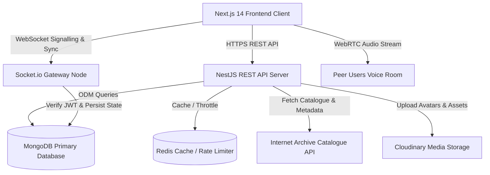

# INTERLUDE — Architecture Overview

## High-Level Architecture Diagram

## Core Components

### 1. Streaming Provider Abstraction
The streaming engine uses an abstract `StreamingProvider` interface. By default, it interfaces with the Internet Archive. Content source swapping requires only updating `.env` (e.g. `STREAMING_PROVIDER=self_hosted`) without modifying frontend code.

### 2. Synchronization Engine
Session playback synchronization relies on a server-authoritative WebSocket architecture (`WatchGateway`). The host sends timestamped state updates, and the server broadcasts sync commands to all connected participants.

### 3. Voice Signalling
Voice chat uses WebRTC mesh networking. The NestJS `VoiceGateway` handles SDP offers, answers, and ICE candidate exchanges between peers.
